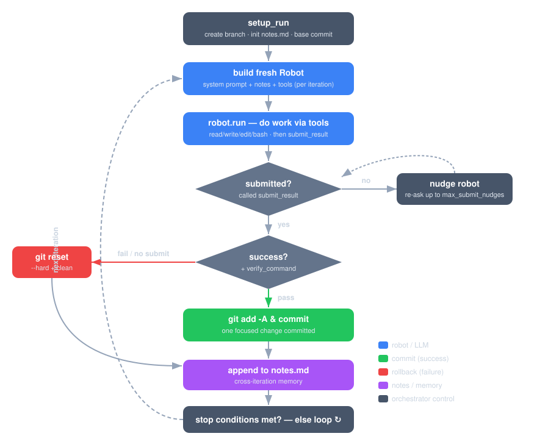

# robot_lab-to

**Autonomous overnight agent loop for [RobotLab](https://github.com/MadBomber/robot_lab) — run a robot while you sleep.**

`robot_lab-to` ("takeover") runs a RobotLab `Robot` in an autonomous loop toward a
stated objective, committing **one focused change per iteration**. Each iteration
spins up a fresh robot, lets it work, and asks it to report a result. Good
iterations are committed; failures are rolled back. A running log (`notes.md`)
carries memory across iterations so the robot learns from what came before.

Start it before bed; review the branch in the morning.

```bash
robot-to "Increase test coverage of the parser to 90%" \
  --max-iterations 20 \
  --verify-command "bundle exec rake test"
```

---

## How it works

Every iteration is an independent, sandboxed attempt at *one* improvement. The
orchestrator owns the git history and the stop conditions; the robot owns the
work.



1. **Build a fresh robot** with a per-iteration system prompt that includes the
   objective and the accumulated notes.
2. **The robot works** and calls `submit_iteration_result` to report success or
   failure.
3. **The orchestrator decides** — an independent `--verify-command` (if set) must
   pass, then the change is committed. Otherwise the working tree is reset.
4. **Notes are updated** with what happened, becoming context for the next round.
5. **Stop conditions are checked** — iterations, tokens, consecutive failures, or
   a natural-language `--stop-when` — and the loop continues or ends.

See [The Iteration Loop](concepts/iteration-loop.md) for the full lifecycle.

---

## Why use it

- **Bounded, reviewable history.** Each iteration is a single commit on a
  dedicated branch. Bad attempts never reach the branch — they are reset before
  the next try.
- **Cross-iteration memory.** `notes.md` records summaries, changes, and learnings
  so the robot doesn't repeat itself. See [Cross-Iteration Memory](concepts/notes.md).
- **Independent verification.** The robot can't self-certify success — a real
  command you choose is the deciding authority. See [Verification Gate](concepts/verification.md).
- **It stops on its own.** Hard limits plus a natural-language stop condition mean
  you can leave it unattended. See [Stop Conditions](concepts/stop-conditions.md).
- **Runs on local models.** With `--local-guards` it ships built-in file tools and
  small-model guardrails, so it can drive a local Ollama model offline. See
  [Local Models](local-models/index.md).

---

## Quick links

<div class="grid cards" markdown>

- :material-rocket-launch: **[Installation](getting-started/installation.md)** — install the gem and the `robot-to` CLI.
- :material-play: **[Quick Start](getting-started/quick-start.md)** — your first overnight run in five minutes.
- :material-cog: **[Configuration](configuration/index.md)** — every setting, the config cascade, and the CLI.
- :material-laptop: **[Local Models](local-models/index.md)** — drive a local Ollama model with guardrails.
- :material-sitemap: **[Architecture](reference/architecture.md)** — how the pieces fit together.

</div>

---

## Requirements

- Ruby **>= 3.2**
- A git repository with at least one commit (the loop branches and commits there)
- The [`robot_lab`](https://github.com/MadBomber/robot_lab) gem and an LLM provider
  (a cloud key such as `ANTHROPIC_API_KEY` / `OPENAI_API_KEY`, **or** a local
  [Ollama](https://ollama.com) server)
