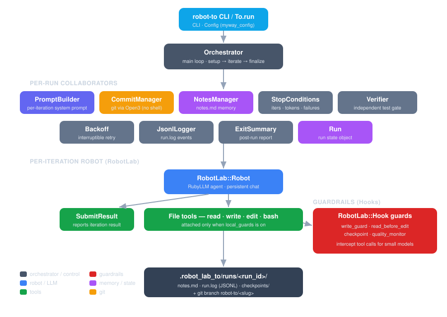

# Architecture

`robot_lab-to` is a thin, well-separated orchestration layer over RobotLab. The
`Orchestrator` owns the loop and the git history; everything else is a
single-purpose collaborator it drives.



## Component map

| Component | File | Responsibility |
|-----------|------|----------------|
| `CLI` | `cli.rb` | `OptionParser`-based `robot-to` entry point. |
| `Config` | `config.rb` | `MywayConfig::Base` settings cascade. |
| `Orchestrator` | `orchestrator.rb` | The main loop: setup → iterate → commit/rollback → stop → finalize. |
| `PromptBuilder` | `prompt_builder.rb` | Builds each iteration's system prompt (objective, notes, task, submit, repair, stop-when). |
| `Run` | `run.rb` | Mutable run-state value object (iteration, counters, tokens, timing, paths). |
| `SubmitResult` | `tools/submit_result.rb` | Tool the robot calls to report its result. |
| `IterationResult` | `iteration_result.rb` | `Data.define` value object for a submitted result. |
| `CommitManager` | `commit_manager.rb` | All git operations via `Open3` (no shell interpolation). |
| `NotesManager` | `notes_manager.rb` | Reads/writes the cross-iteration `notes.md`. |
| `StopConditions` | `stop_conditions.rb` | Evaluates iterations / tokens / failures / stop-when. |
| `Verifier` | `verifier.rb` | Runs the independent `--verify-command` gate. |
| `Backoff` | `backoff.rb` | Interruptible exponential backoff for retries. |
| `JsonlLogger` | `jsonl_logger.rb` | Append-only JSONL event log with a pre-init buffer. |
| `ExitSummary` | `exit_summary.rb` | Prints the post-run report. |
| `AtomicFile` | `atomic_file.rb` | Atomic writes/appends for `notes.md`. |

## Local-model layer

These components are active only when `--local-guards` is set:

| Component | File | Responsibility |
|-----------|------|----------------|
| `Tools::FileTool` | `tools/file_tool.rb` | Base class giving file tools short names. |
| `Tools::Read/Write/Edit/Bash` | `tools/*.rb` | Built-in workspace tools. |
| `Guards` | `guards.rb` | Registers all guards on a robot via `install`. |
| `Guards::WriteGuard` | `guards/write_guard.rb` | Refuse `write` on existing files; normalize paths. |
| `Guards::ReadBeforeEdit` | `guards/read_before_edit.rb` | Refuse `edit` before `read`. |
| `Guards::Checkpoint` | `guards/checkpoint.rb` | Snapshot files before mutation. |
| `Guards::QualityMonitor` | `guards/quality_monitor.rb` | Detect repeated-tool-call loops. |
| `Guards::RunStore` | `guards/run_store.rb` | Thread-local per-run guard state. |
| `Guards::PathResolution` | `guards/path_resolution.rb` | Pure path helpers shared by the guards. |

See [Guardrails](../local-models/guardrails.md) and
[Built-in Tools](../local-models/tools.md).

## Key design decisions

### Fresh robot per iteration

Each iteration constructs a new `RobotLab::Robot`. There is no shared chat history;
continuity is carried entirely by `notes.md`. This keeps every iteration a clean,
independent attempt and bounds context growth.

### The orchestrator owns git, the robot owns work

The robot never commits. It makes changes and reports a result; the orchestrator
decides whether to commit (gated by the verifier) or roll back. This separation is
what makes the git history trustworthy.

### Tools attach via `local_tools:`

Tool *instances* are passed to `RobotLab.build` as `local_tools:`. (RobotLab's
`tools:` parameter is a name *allowlist filter*, not an instance list — passing
instances there silently attaches nothing.) A regression test asserts the built
robot actually exposes the submit tool, guarding against that class of mistake.

### Streaming is optional

By default the robot streams, enabling per-chunk token accounting and mid-stream
budget enforcement. Local Ollama models run non-streaming (`stream: false`), so
tokens are accounted from each iteration's result and the budget is enforced at
iteration boundaries. See [Ollama Setup](../local-models/ollama.md#streaming-and-tool-calls).

### Interruptible by design

Signal handlers, the backoff sleep, and the per-iteration runner thread all
cooperate so a `SIGINT`/`SIGTERM` stops the run promptly and cleanly, with the
exit summary still printed.

## Run lifecycle (control flow)

```
To.run(objective, **opts)
└─ Orchestrator#run
   ├─ setup_run            branch, notes, run dir, collaborators
   ├─ main_loop
   │  └─ per iteration:
   │     ├─ build fresh robot (PromptBuilder + tools [+ guards])
   │     ├─ robot.run  → SubmitResult captured
   │     ├─ nudge if not submitted
   │     ├─ verify (if configured)
   │     ├─ commit (success) / reset --hard (failure)
   │     ├─ NotesManager append
   │     └─ StopConditions check
   └─ finalize_run         JSONL close, ExitSummary
```

---

Next: [Changelog](../about/changelog.md).
